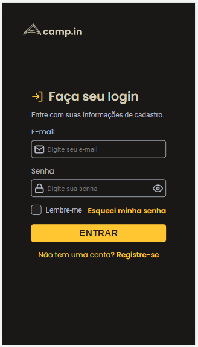
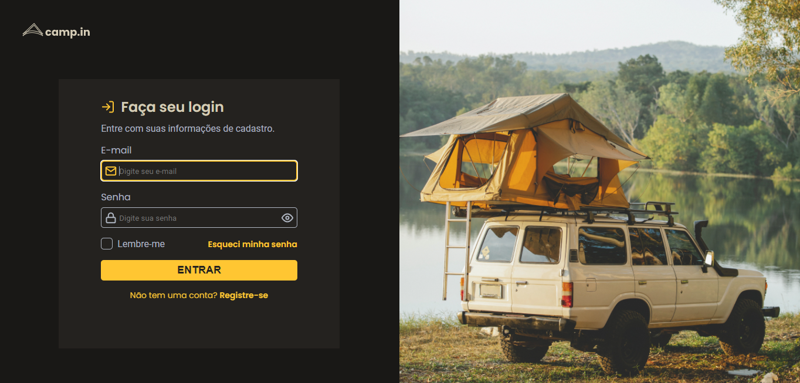

# Login-Form-CSS
Desafio Login Form CSS do Rocketseat. 

Criar um formulário de login responsivo. 

## 💻 Layout  

### Mobile

  

### Web

  

 ## 🔧 Tecnologias 

As tecnologias usadas foram: 
* HTML
* CSS
